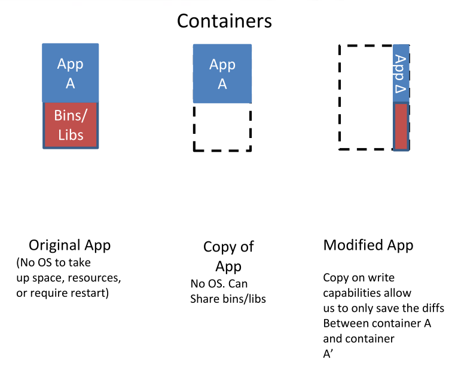
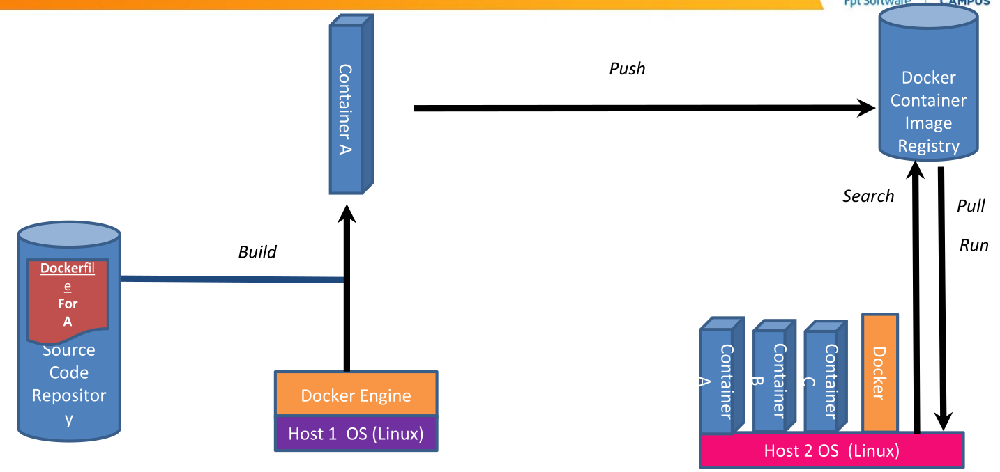
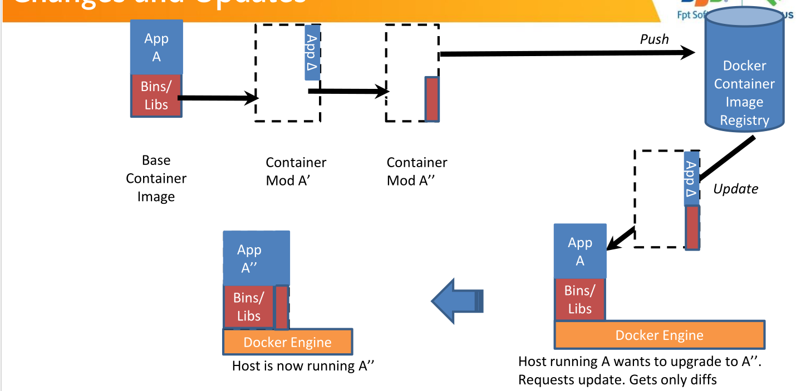

# Virtualization
- Beefy computer? Can't make the most out of it? slice it into small computers and share it => virtualization

## Types of virtualization
- Data virtualization
- Desktop virtualization
- Server virtualization
- OS virtualization
- Network functions virtualization

# Containerization
## Intro
- Containerization is packing software code along ith the needed dependencies and OS libraries inside a executable file (container)
- Despite the isolation, container still share the OS kernel and some OS bins/libs with other process 


### What happen when new image is built


### Update?

### Docker vocabulary?
- Image:
- Container:
- Engine:
- Registry service:
### Some commands
```bash
$ docker image pull node:latest
$ docker image ls
$ docker container run –d –p 5000:5000 –-name node node:latest
$ docker container ps
$ docker stop <container id>
$ docker rm <container id>
$ docker image rmi (or <image id>)
$ docker build –t node:2.0 .
$ docker image push node:2.0
$ docker --help
```


