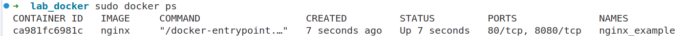
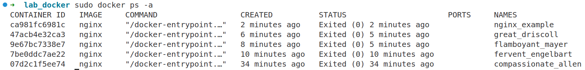
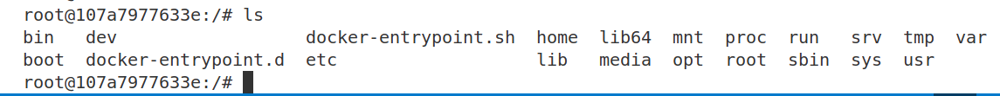

# LAB1
**Check docker version**
```
➜  lab_docker docker --version
Docker version 28.3.3, build 980b856
```

**Search docker images on Docker Hub**
```
➜  lab_docker sudo docker search nginx
[sudo] password for dvc: 
NAME DESCRIPTION STARS OFFICIAL
nginx Official build of Nginx. 20931 [OK]
```

**Pull nginx latest image from Docker Hub**
```Bash
➜  lab_docker sudo docker image pull nginx:latest 
latest: Pulling from library/nginx
59e22667830b: Pull complete 
140da4f89dcb: Pull complete 
96e47e70491e: Pull complete 
2ef442a3816e: Pull complete 
4b1e45a9989f: Pull complete 
1d9f51194194: Pull complete 
f30ffbee4c54: Pull complete 
Digest: sha256:84ec966e61a8c7846f509da7eb081c55c1d56817448728924a87ab32f12a72fb
Status: Downloaded newer image for nginx:latest
docker.io/library/nginx:latest
```

**Show list image on local**
```Bash
➜  lab_docker sudo docker image ls  
REPOSITORY   TAG       IMAGE ID       CREATED       SIZE

nginx        latest    2cd1d97f893f   3 weeks ago   192MB
```
**Run docker container in detach mode and mapping to port 8080 of local machine**
- run in detach mode means running in the background without logging to the terminal, using ``-d``

**Check running containers**


**Check all containers (include not running containers)**


Stop a container

Start a container

**Remote to a running container or run a command in a running container**


Tagging a docker image Then, finish following task:
- Create your own Docker Hub account
- Create repository
- Push nginx image to your repository
- Delete nginx image in your local machine
- Try to pull the nginx image from your repository