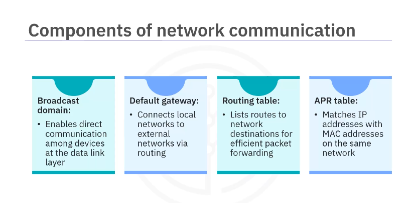
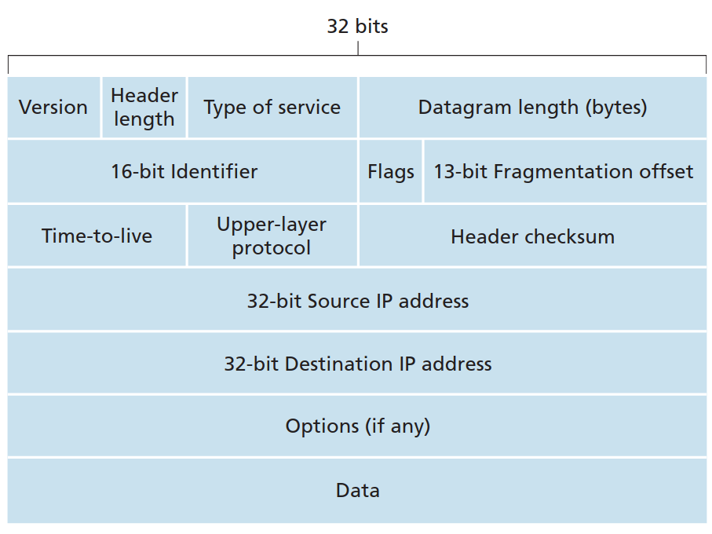

# Linux netwoking
## CompNet review and Linux networking
### IP Protocol and Traffic Routing
IP protocol and IP addresses **Route packets among devices** and **Ensure reliable communication**

#### IP protocol
- Use layer 3 devs.
- all routers inspect destination address by processing the header.
- stateful firewalls also inspect the source.
#### IP address
- use 4 octets: x.x.x.x x in [0-255]
#### IP header
Network layer packets are refered as datagram

- **TTL**: Keep the datagram from circulating forever, -1 every time it pass a hop, if router recieve Packet with TTL=0, it drop immediately and not forward it. In some protocol like DNS, the TTL can be measured in second.
#### Default gateway
help sending packet outside local network

### Routers and routing tables
#### ARP (Address Resolution Protocol)
- Make sure data sent to an IP address reach to the correct device in a local network.
- Locate MAC addr that linked to an IP address
- it store that mapping in an ARP mapping table. 
#### Routing table
- Help directing packets to their destinations
- Every device that connect to a network all maintain a routing table
- This what routing table in linux looks like

```bash
➜  ~ netstat -nr
Kernel IP routing table
Destination     Gateway         Genmask         Flags   MSS Window  irtt Iface
0.0.0.0         10.35.40.1      0.0.0.0         UG        0 0          0 wlp1s0
10.35.40.0      0.0.0.0         255.255.252.0   U         0 0          0 wlp1s0
172.17.0.0      0.0.0.0         255.255.0.0     U         0 0          0 docker0

```
- The Destination column shows the destination IPs of outgoing packets from your computer.
- The destination ```0.0.0.0``` (first line) is the default route, when a packet is sent from the computer, the kernel check if the destination IP is in the routing table or not, if not, it will forward the packet to the default gateway.

#### Types of routes
##### Default route
- For data sent to a destination that not in the routing table. The data will be forwarded to the default gateway
##### Connected route
- Destination that exist in the routing table
##### Dynamic and static route
- Static: manually set
- Dynamic: auto set by protocols
#### What is net interface?
A network interface is a connection point that allows a computer (or any networked device) to communicate over a network. It can be either physical (like an Ethernet card or Wi-Fi adapter) or virtual (like lo for loopback, or docker0 for Docker containers). This device is similar to audio interface in the computer.

```bash
➜  Linux ip address
1: lo: ...
2: wlp1s0: ...
3: docker0: ...
```

This is an example of listing linux net interfaces available on the machine, we have: 

```lo```: the loopback interface(localhost)

```wlp1s0```: the wifi interface of the machine

```docker0```: docker 


### DNS and DHCP
- **DNS(Domain Name System)** is a network service that help translate domain name to IP address. 
- **DHCP (Dynamic Host Configuration Protocol)** Automatically assign IP to devices in network.
## Tools used
### ```ping```
#### Check if a host is reachable 
Example ping google.com to check if Google's server is online and reachable.

#### Diagnose network problems
If there's no response, you might have:
- Internet issues
- DNS problems
- Firewall blocking traffic

#### Measure latency
ping shows round-trip time in milliseconds (ms), useful to test speed or lag.

#### Detect packet loss
If some replies are missing, you may have network instability.


```bash
➜  Linux ping -c 3 localhost 
PING localhost (127.0.0.1) 56(84) bytes of data.
64 bytes from localhost (127.0.0.1): icmp_seq=1 ttl=64 time=0.056 ms
64 bytes from localhost (127.0.0.1): icmp_seq=2 ttl=64 time=0.032 ms
64 bytes from localhost (127.0.0.1): icmp_seq=3 ttl=64 time=0.037 ms

--- localhost ping statistics ---
3 packets transmitted, 3 received, 0% packet loss, time 2053ms
rtt min/avg/max/mdev = 0.032/0.041/0.056/0.010 ms
```

### ```traceroute```
Track the route of packets from local computer to the host
```bash
➜  Linux traceroute google.com 
traceroute to google.com (142.250.76.14), 30 hops max, 60 byte packets
 1  _gateway (10.35.40.1)  4.232 ms  4.174 ms  4.151 ms
 2  10.35.24.17 (10.35.24.17)  4.132 ms  4.112 ms  4.203 ms
...
```
send multiple packets with increasing TTL and record for each packets 


### ```ip```
__Note__: ```ifconfig``` is deprecated, now use ```ip```
### ```netstat```
### ```mtr```
- a live network monitoring tool like top, htop


