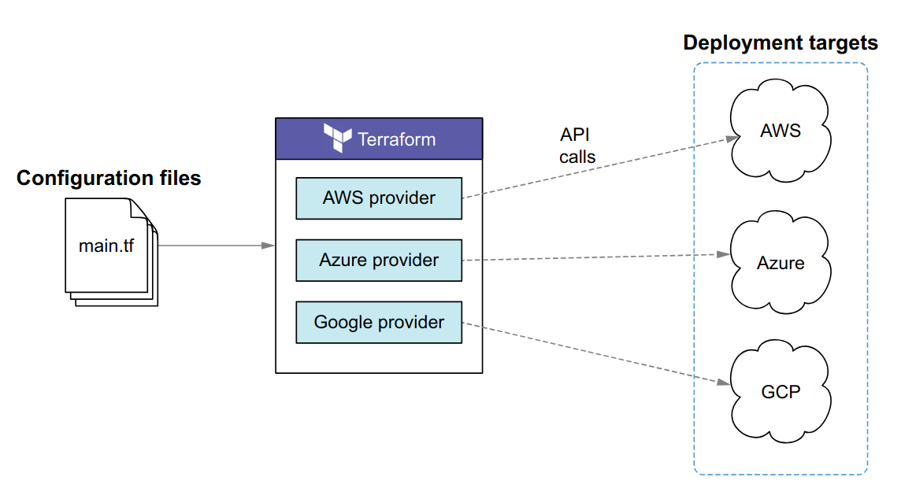
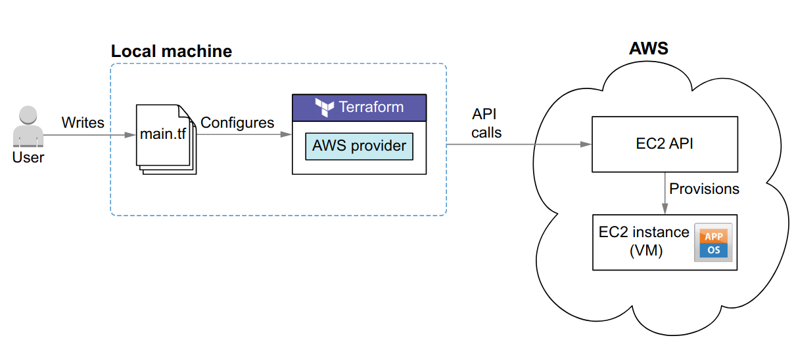
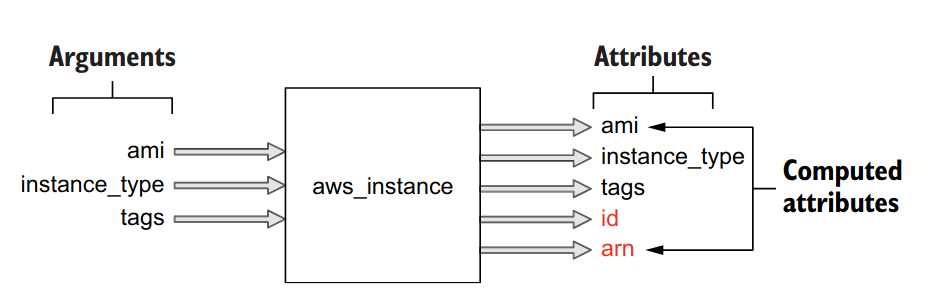
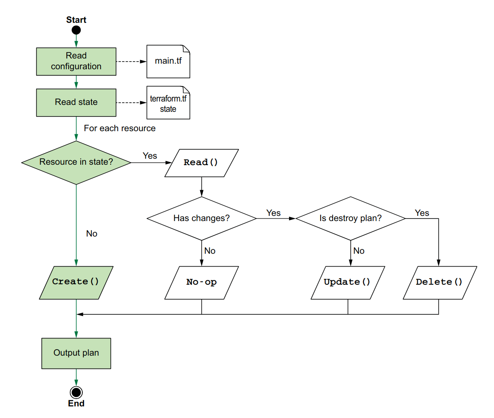
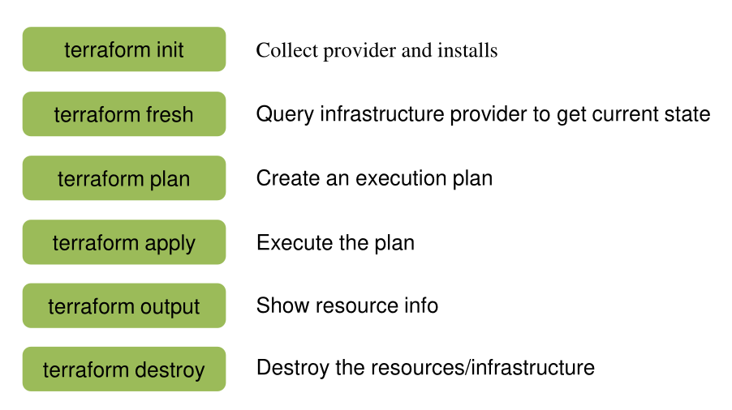
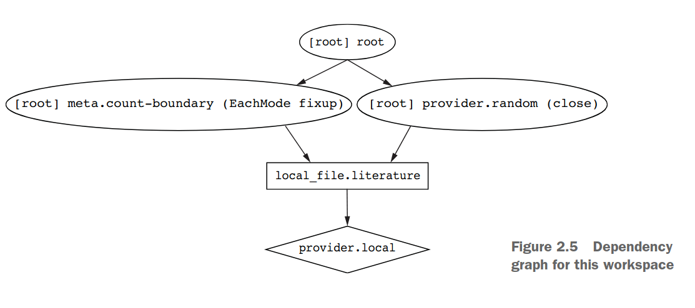

# Infra as Code introduction
## What problem does IaC solve
<table border="1" cellpadding="8" cellspacing="0">
  <thead>
    <tr>
      <th>Problem</th>
      <th>How IaC Solves It</th>
    </tr>
  </thead>
  <tbody>
    <tr>
      <td>Manual Configuration Errors</td>
      <td>Automates setup using code, reducing human error and ensuring consistency.</td>
    </tr>
    <tr>
      <td>Lack of Consistency Across Environments</td>
      <td>Ensures the exact same configuration is applied to all environments.</td>
    </tr>
    <tr>
      <td>Time-Consuming Provisioning</td>
      <td>Infrastructure can be provisioned in minutes or seconds with a single command.</td>
    </tr>
    <tr>
      <td>Poor Scalability</td>
      <td>Infrastructure can be scaled programmatically and automatically based on demand.</td>
    </tr>
    <tr>
      <td>No Version Control</td>
      <td>Infrastructure definitions are stored in version-controlled files, enabling rollbacks, reviews, and audits.</td>
    </tr>
    <tr>
      <td>Hard to Reproduce Infrastructure</td>
      <td>Just re-run the code to recreate the environment exactly as it was.</td>
    </tr>
    <tr>
      <td>Inefficient Collaboration</td>
      <td>Enables collaborative workflows using pull requests, code reviews, etc.</td>
    </tr>
  </tbody>
</table>

# Terraform Basic

Fundamentally, Terraform is a **state management tool that performs
CRUD operations** (create, read, update, delete) on managed resources. Often, managed resources are cloud-based resources, but they don’t have to be. Anything that can be represented as CRUD can be managed as a Terraform resource

*Example use case (Deloying an EC2 instance on the cloud)*


- First step in this sequence is to write .tf file with the infra configuration, cloud conf
- initialize with ```terraform init```
- deploy with ```terraform apply```
- destroy with ```terraform destroy```

## Terraform resource
```HCL
resource "aws_instance" "helloworld" {
    ami = "ami-09dd2e08d601bff67"
    instance_type = "t2.micro"
    tags = {
        Name = "HelloWorld"
    }
}
```
- This is an example of a terraform ```resource```, it start with ```resource``` to define this is a resource, the next 2 fields as the resource type and name respectively

**Terraform Resource** is the most important component of a tf file, it provision infrastructure such as VMs, load balancers, NAT gateways, and so forth

Each resource have inputs (arguments) and outputs (attributes)


**Inputs** are the arguments that you provide to a resource in your Terraform configuration code. They define the desired state or characteristics of the infrastructure you want to provision

**Outputs** also known as attributes, are the information or properties that a resource exposes after it has been created or read by Terraform. These values represent the actual state of the managed infrastructure

### Resource life cycle
<table>
  <thead>
    <tr>
      <th>Action</th>
      <th>Trigger</th>
    </tr>
  </thead>
  <tbody>
    <tr>
      <td>Create</td>
      <td>When you run <code>terraform apply</code></td>
    </tr>
    <tr>
      <td>Read</td>
      <td>When Terraform checks current state</td>
    </tr>
    <tr>
      <td>Update</td>
      <td>When you change config</td>
    </tr>
    <tr>
      <td>Delete</td>
      <td>When you remove the resource block</td>
    </tr>
  </tbody>
</table>



### Removing a resource
- in common sense, if you wished to remove a resource, just simply delete it from the config file. However, shit aint that simple by removing the resource block, terraform will kill that object on the cloud. In some cases, that resource can be manging by other team and we don't want that to happen.
- In the terraform version 1.7, they included this block
```
removed {
  from = aws_instance.example

  lifecycle {
    destroy = false
  }
}
```

- For the ealier versions, have fun using ``terraform state rm``
### Condition check
### Operation Timeout
### Meta-arguments
#### ``count``
- Skip this if you want to copy and paste 1000 EC2 instances in the config file
- Example usage:
```HCL
resource "aws_instance" "server" {
  count = 4 # create four similar EC2 instances

  ami           = "ami-a1b2c3d4"
  instance_type = "t2.micro"

  tags = {
    Name = "Server ${count.index}"
  }
}
```
#### ``for_each``
- Same usecase

#### ``provider``
- For multi-region projects
```HCL
# default configuration
provider "google" {
  region = "us-central1"
}

# alternate configuration, whose alias is "europe"
provider "google" {
  alias  = "europe"
  region = "europe-west1"
}

resource "google_compute_instance" "example" {
  # This "provider" meta-argument selects the google provider
  # configuration whose alias is "europe", rather than the
  # default configuration.
  provider = google.europe

  # ...
}
```
#### ``lifecycle``
- might visit later

## Provisioners
- **Automatically fire bash script that can accidentally launch the US nuclear ballistic missiles into Xi's bedroom or Putin's flat** if done incorrectly, so this is the last resort for the usecase where you want to provision you infra.

```
resource "aws_instance" "web" {
  # ...

  provisioner "local-exec" {
    command = "echo The server's IP address is ${self.private_ip}"
  }
}
```
## Terraform files and directory
- With human, our shitty brain and fucked up attetion span can't handle a config file with quanzillion of lines. However, terraform is superior, it will **concatenate all the files in a module into a huge ass monolithic piece of shit** and process it at once 
- ``module`` is a collection of ``.tf`` files in a diretory
- if inside a module **exist a subdir**, shit ain't gon be included and will be treated as a ``module`` itself, if you want to include dat shii in the compilation, explicitly include is through module call
- Multiple modules can cause chaos, however, terraform handle it  with the concept of **Single root module**. Most of the time, the directory where terraform is invoked, is the root modules.
- In HCP(SaaS for teams to colaborate on TF) and Terraform enterprise, the root module will be the top level of config directory.
## Terraform basic commands
after creating the main file, execute the following command to create the infra on cloud 


## Terraform provider
- Unlike resource, provider only have one label, which is the name of that provider in the terrform registry

- **Provider** provide those resources used in your lameass money-burning cloud project, *eg. aws provides aws_instance* 
- **Provider** version is independent from terraform, best practice is to constraint the provider version in the config file, so it wont burn the whole infra down when ``terraform init``

### Provider configuration
- Remember the *single root module*, configuration for provider belong in the root module 
```
provider "google" {
  project = "acme-app"
  region  = "us-central1"
}
```
- inside this block is where you configure the provider, *version*, *region* or *alias* for multiple configuration for the same provider

- Whenever a resource for a provider that has not yet been utilized in the configuration directory is added, it is necessary to initialize the directory by executing the ``terraform init`` command again.

### Requiring provider
- Usually, provider requirement will be put in a *provision.tf* file like this
```
  terraform {
    required_version = ">= 1.5.0"
    required_providers {
      aws = {
        source = "hashicorp/aws"
      }
    }
    backend "s3" {
      bucket         = "layered-terraform-11129"
      key            = "layer01-networking/terraform.tfstate"
      region         = "us-east-1"
      dynamodb_table = "terraform-lock-table"
      encrypt        = true
    }
  }
```
- The ``required_providers`` block must be put in the top level inside the ``terraform`` block
- inside ``required_providers`` block, each argument is a provider with syntax

```
<<local_name>>={
  source = <<source>>
  version = <<version>>
}
```
- ``local_name`` will be the name of that provider outside require_provider block. Every provider have its prefered local name, try to use that name as you can omit the *provider* field in the resource block because terraform will implicitly take the first word of the resource as the provider name
- ``source`` is unique for every provider, it have the structure like this ``[\<HOSTNAME\>/]\<NAMESPACE\>/\<TYPE\>``, is omitted, default asign to *registry.terraform.io* 
## Data source
- Long story short, this is a special kind of resource, with almost the same syntax, however, normal ``resource`` can CRUD real infra object while ``data`` only read

## Remote State
After executing ```terraform apply``` a new ```terraform.tfstate``` file is created
## Input variables
Terraform follows a variable definition precedence order to determine the value and the command line flag of ```–var```(set individual var) or ```–var-file```(set multiple vars by a file, usually ```.tfvars``` file) takes the highest priority.

- you know what is better than a terraform module? a reusable module that can easily apply different terraform configurations. That why seperating config value as variables is essential. 
- when calling a module from another module, these variables within the callee must be specified, like passing parameter to a function when calling it. If you are a dev who know shit bout Terraform, here's the mapping from programming to terraform 

  - **Input variables** are like function arguments.
  - **Output values** are like function return values.
  - **Local values** are like a function's temporary local variables.

- This is an example of a terraform module which call another module
```
module "networking" {
    source = "../modules/networking"
    cidr_block = var.cidr_blocks
    vpc_name = var.vpc_name
    subnets = var.subnets
    region = var.region
}
```
- as you can see here, the variable of the callee is explicitly provided

- syntax example
```
  variable "availability_zone_names" {
    type    = list(string)
    default = ["us-west-1a"]
  }
```

- The variable name (identifier) can be anything *(rocketship, cheesbuger, cocksucker293, ...)* however, these names must be avoid as they are reserve for module configuration when importing module to another module. They are:
  - ``source, version, providers, count, for_each, lifecycle, depends_on, locals``

- there are some useful arguments for variable. Note that ``default`` must be a literal value, you cannot reference other objects of the configuration. A good ``description`` can make you easier to be replaced. 
- You can custom ``validation`` rule like this
```
variable "image_id" {
  type        = string
  description = "The id of ami"
  validation {
    condition     = length(var.image_id) > 4 && substr(var.image_id, 0, 4) == "ami-"
    error_message = "The image_id value must be a valid AMI id, starting with \"ami-\"."
  }
}
```
- By setting ``ephemeral = true``, you will have a temporal variable, like session id, temp token. By enabling this, the value will not be store in plan file or state map
```
variable "session_token" {
  type      = string
  ephemeral = true
}
```

- In other case, ``sensitive = true``, will not output the variable value in the terminal when ``plan`` and ``apply``, but shit still save in .tfstate
- to assign the var you can use ``-var`` or ``.tfvars`` file
```
terraform apply -var="image_id=ami-abc123"
terraform apply -var='image_id_list=["ami-abc123","ami-def456"]' -var="instance_type=t2.micro"
terraform apply -var='image_id_map={"us-east-1":"ami-abc123","us-east-2":"ami-def456"}'
```
## Terraform output
- Output is useful in the case where a module call another module. When the caller want to access a resource attribute from the callee. The callee must declare that variable by this
```
output "instance_ip_addr" {
  value = aws_instance.server.private_ip
}
``` 

- if a child module named web_server declared an ``output`` named ``instance_ip_addr``, you could access that value as module.web_server.``instance_ip_addr``

- ``emphemeral`` can also be used in output variables
```
output "secret_id" {
  value       = aws_secretsmanager_secret.secret_id
  description = "Temporary secret ID for accessing database in AWS."
  ephemeral   = true
}
```
- however, this can only be used in the following cases:
  -  In a write-only argument
  -  In another child module's ephemeral output block
  -  In ephemeral variables
  -  In ephemeral resources

## Dependency graph
every ``terraform plan`` generates a dependency graph for respecting implicit and explicit dependencies between resource and provider nodes.



# Terraform with AWS